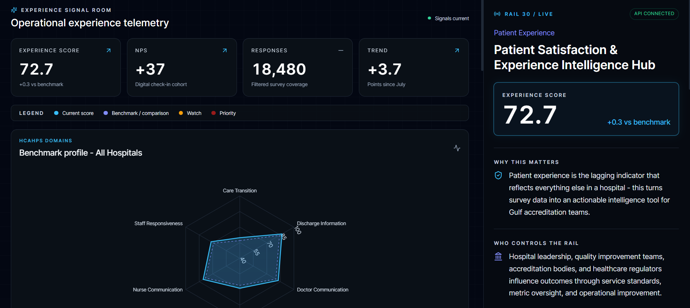
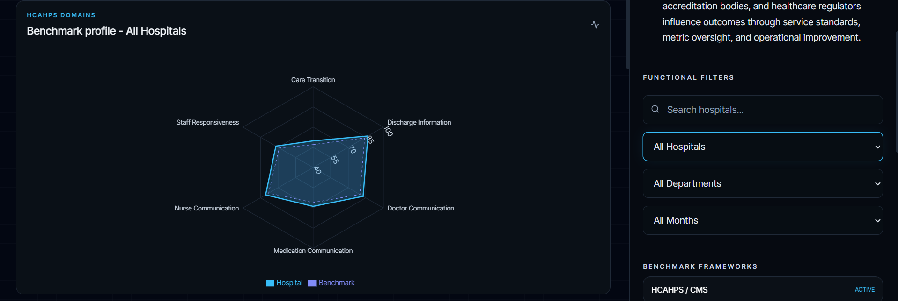
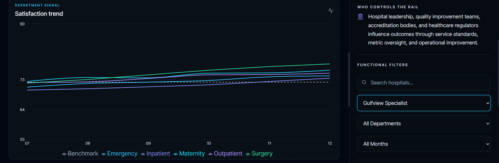
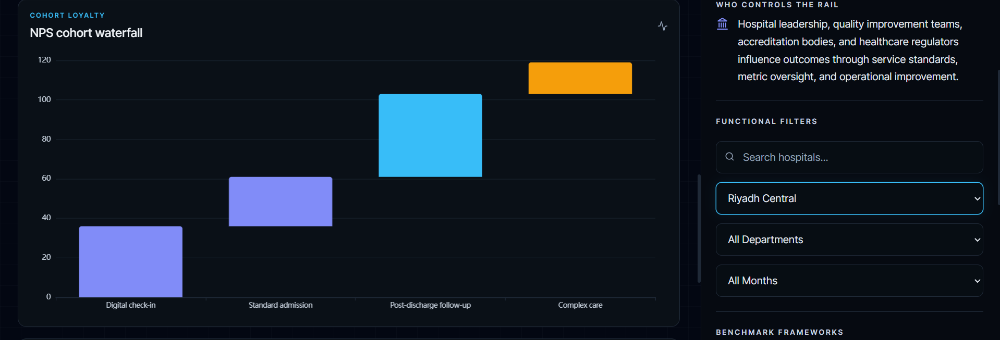
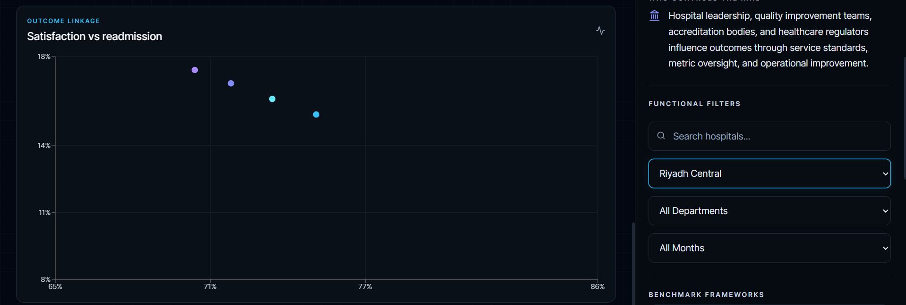
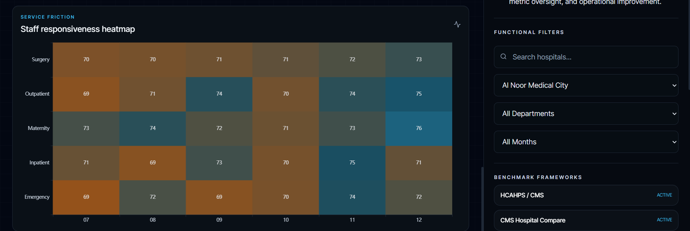
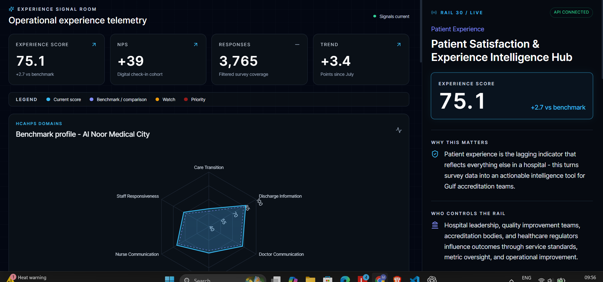
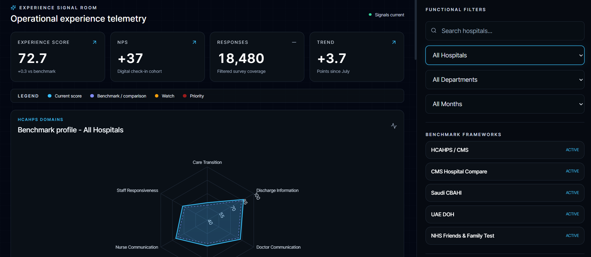
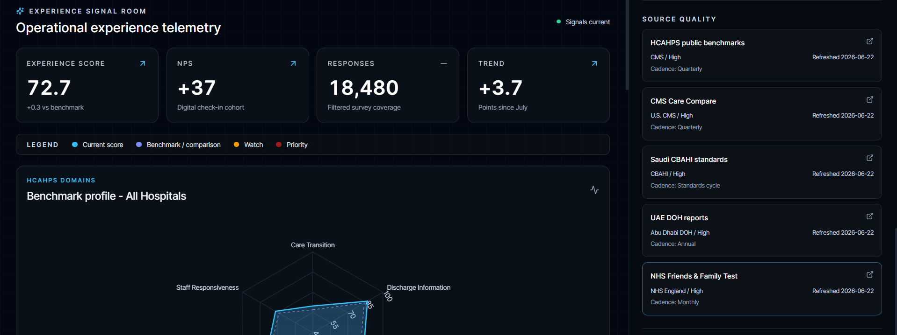
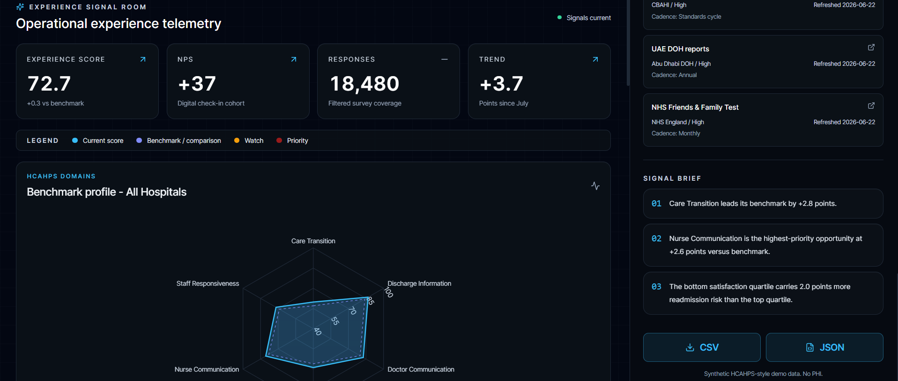

# Patient Satisfaction & Experience Intelligence Hub

## Project Overview

The **Patient Satisfaction & Experience Intelligence Hub** is an interactive healthcare analytics platform designed to transform patient-experience survey data into actionable intelligence for clinicians, hospital administrators, quality teams, and healthcare investors.

The application provides a unified dashboard for analyzing:

* HCAHPS-style patient experience domain scores
* Net Promoter Score (NPS) trends
* Satisfaction versus readmission correlations
* Department-level responsiveness performance
* Accreditation and benchmark comparisons

Built using **Next.js**, **TypeScript**, **FastAPI**, and **Tailwind CSS**, the platform follows the Gulf Healthcare Real Rails Intelligence Library architecture with a 70/30 visualization-to-intelligence layout.

---

# Problem Statement

Healthcare organizations collect large volumes of patient-experience data from surveys and accreditation frameworks. However, this information is often fragmented across multiple reporting systems, making it difficult to:

* Identify performance gaps quickly
* Compare results against industry benchmarks
* Understand relationships between satisfaction and clinical outcomes
* Monitor department-level trends over time
* Communicate insights effectively to decision makers

The Patient Satisfaction & Experience Intelligence Hub addresses these challenges by providing a centralized intelligence dashboard that converts raw survey metrics into meaningful operational insights.

---

# Architecture Summary

## Frontend

**Technology Stack**

* Next.js 14
* React 18
* TypeScript
* Tailwind CSS
* Recharts
* Apache ECharts
* Lucide Icons

### Key Components

* KPI Intelligence Cards
* HCAHPS Domain Radar Chart
* Satisfaction Trend Analysis
* NPS Cohort Waterfall Chart
* Satisfaction vs Readmission Scatter Plot
* Staff Responsiveness Heatmap
* Intelligence Sidebar

---

## Backend

**Technology Stack**

* FastAPI
* Python
* Pandas
* Pydantic

### API Endpoints

| Endpoint           | Description              |
| ------------------ | ------------------------ |
| `/api/health`      | Service health check     |
| `/api/dashboard`   | Dashboard analytics data |
| `/api/sample.csv`  | Synthetic dataset export |
| `/api/sample.json` | Synthetic dataset export |

---

## Data Layer

The platform utilizes reusable source adapters for benchmark and accreditation sources:

| Source                             | Authority |
| ---------------------------------- | --------- |
| HCAHPS Public Benchmarks           | CMS       |
| Hospital Compare                   | CMS       |
| Saudi Patient Experience Standards | CBAHI     |
| UAE Experience Reports             | UAE DOH   |
| Friends & Family Test              | NHS       |

Synthetic healthcare datasets are used for demonstration purposes and contain no patient-identifiable information.

---

# Setup Instructions

## Prerequisites

* Node.js 18+
* Python 3.11+
* npm
* pip

---

## Backend Setup

```bash
cd backend

python -m venv .venv

# Windows
.venv\Scripts\activate

pip install -r requirements.txt

uvicorn app.main:app --reload --port 8000
```

Backend runs at:

```text
http://localhost:8000
```

API Documentation:

```text
http://localhost:8000/docs
```

---

## Frontend Setup

```bash
cd frontend

npm install

npm run dev
```

Frontend runs at:

```text
http://localhost:3000
```

---

## Environment Variables

Create a `.env.local` file inside the frontend folder:

```env
NEXT_PUBLIC_API_URL=http://localhost:8000
```

---

# Screenshots

### Dashboard Overview



### HCAHPS Benchmark Radar



### Satisfaction Trend Analysis



### NPS Cohort Waterfall



### Satisfaction vs Readmission Correlation



### Staff Responsiveness Heatmap



### Intelligence Sidebar

1.

2.

3.

4.


---

# AI Usage Summary

Artificial Intelligence tools were used during development for:

### Design Assistance

* Dashboard layout planning
* Information architecture recommendations
* Real Rails intelligence-panel design guidance
* Visualization selection validation

### Development Assistance

* React component scaffolding
* TypeScript interface generation
* FastAPI endpoint structure generation
* Data-model design support

### Documentation Assistance

* UAT report generation
* Visualization Audit Report generation
* README drafting
* Technical documentation refinement

### Validation Assistance

* UX review
* Dashboard accessibility review
* Visualization consistency checks
* Architecture compliance verification

All business logic, data mappings, testing, validation, and final implementation decisions were reviewed and validated manually.

---

# Future Enhancements

## Data Integrations

* Live CMS HCAHPS benchmark ingestion
* Real-time hospital survey feeds
* Accreditation reporting integrations
* HL7/FHIR interoperability support

## Advanced Analytics

* Predictive patient satisfaction forecasting
* Readmission risk prediction models
* Sentiment analysis from patient feedback
* Root-cause analysis recommendations

## User Experience

* Drill-down analytics
* Executive summary generation
* Custom dashboard personalization
* Mobile-responsive intelligence views

## Enterprise Features

* Role-based access control
* Multi-hospital benchmarking
* Audit logging
* Scheduled report generation

---

# Project Outcome

The Patient Satisfaction & Experience Intelligence Hub successfully demonstrates how patient-experience data can be transformed into operational intelligence through modern analytics, benchmark frameworks, and interactive visualization techniques.

The project achieved:

* Complete dashboard implementation
* FastAPI backend services
* Interactive healthcare intelligence visualizations
* Synthetic healthcare data generation
* Export capabilities
* 100% UAT test pass rate
* Full Real Rails Intelligence Library compliance
